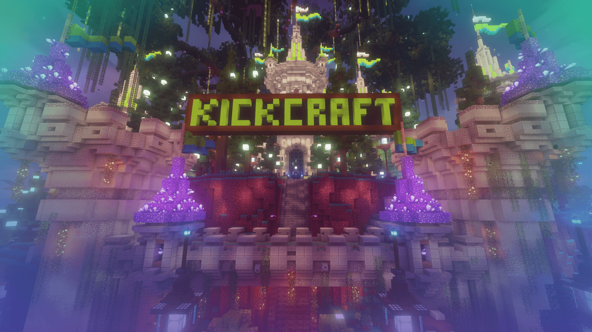

# Welcome to the KickCraft Wiki!

!!! warning

    This wiki is under construction! This is not a final representation of everything. Expect updates to come as we work things out!

This wiki is your one-stop shop for everything related to our Minecraft server designed specifically for content creation. Explore a world full of possibilities, collaborate with fellow creators, and craft unforgettable stories for your viewers!

<!---
## What you'll find here

* **Server Information:** Get the lowdown on server rules, plugins, and unique features you won't find anywhere else.
* **Building Guides:** Unleash your inner architect with detailed guides for pre-built locations, custom biomes, and unique structures.
* **Lore & Backstory:** Dive into the rich lore of the server world, uncovering hidden secrets and crafting your own narratives.
* **Collaboration Corner:** Team up with other creators! Find potential collaborators, brainstorm ideas, and build something truly epic together.
* **Frequently Asked Questions:** Got a burning question? Chances are, it's answered here.
--->

## How to Contribute on this Wiki
!!! info
    Coming soon! An announcement will be made in Discord along with a blog post here on the wiki detailing the future of this wiki.
<!---
This wiki thrives on collaboration! We encourage all content creators on the server to contribute their knowledge and creativity.

* **New to editing Wikis?** No worries! We have a guide to help you get started.
* **Have an amazing build you want to share?** Create a page detailing its creation process and lore!
* **Uncovered a secret in the server world?** Document your findings to help others piece together the story.

## Ready to jump in?

* Explore the wiki using the search bar above.
* Check out the "Getting Started" page for new contributors.
* Join our server Discord to connect with other creators!

We hope you find this wiki a valuable resource. Happy crafting!
--->